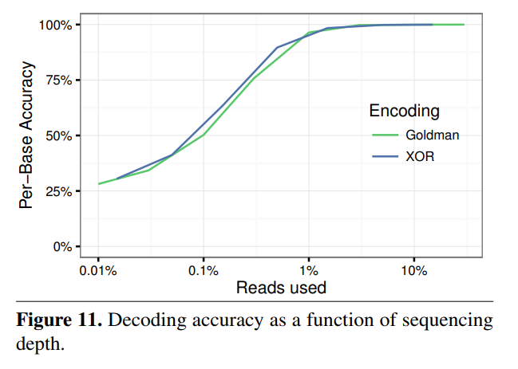

# DNA research

## MSR 端到端原型机器

### 总览

该论文描述了一套端到端 DNA 自动化合成装置的实现原理和方法。下图展示了 DNA 合成和测序的整个流程：首先，数据经过纠错后编码成DNA碱基，然后合成物理DNA分子并存储。此后，当用户希望读取数据时，DNA测序仪会将存储的DNA读取到碱基中，解码软件会更正检索原始数据时出现的任何错误。

四张图分别对应于：（a） 从比特到碱基再到DNA的逻辑流程。（b） 系统硬件三个模块的框图，分别代表：合成、存储和排序。（c）系统总览。突出显示的是存储容器和纳米孔装载夹具。剩余的大部分硬件负责合成。（d）DNA测序酶制剂概述：任意1DNA的千碱基“延伸段”用TAQ聚合酶进行PCR扩增，引物添加Bsa-I限制位点，消化后留下a尾和TCGC粘端。然后将延伸段连接至标准牛津纳米孔技术（ONT）LSK-108工具包排序适配器，创建 `extension segment`，确保读取足够的碱基以便成功测序。为了测序，将 `payload hairpin` 和 `extension segment` 连接起来，形成无需纯化的序列就绪结构。

### 合成模块

在将文件写入DNA之前，必须先将其数据从1和0转换为A、C、T和G。编码软件模块负责此转换，并将错误更正添加到有效载荷序列中。有效载荷序列生成后，添加额外的碱基，以确保其一级和二级结构与读取过程兼容，DNA序列被发送到合成模块，以实例化为物理DNA分子。DNA合成模块围绕两个阀门歧管构建，分别向合成柱输送含水和无水试剂。论文提及：

> Our initial designs used standard valves, but the dead volume at junction points caused unacceptable contamination between cycles. Therefore, we switched to zero dead volume valves[7](https://www.nature.com/articles/s41598-019-41228-8#ref-CR7). The combined flow path is then monitored by a flow sensor, whose output is coupled to a standard fitting; the fitting can be coupled to arbitrary devices, such as a flow cell for array synthesis[8](https://www.nature.com/articles/s41598-019-41228-8#ref-CR8) or, in this case, adapted to fit a standard synthesis column. 

（我们最初的设计使用了标准阀门，但连接点的死容积在循环之间造成了不可接受的污染。因此，我们切换到零死容积阀。然后，由流量传感器监测组合的流道，其输出与标准配件相耦合；该配件可以耦合到任意设备，例如用于 `array synthesis` 的 `flow cell`，或者在这种情况下，适配于标准合成柱。）

一旦合成完成，合成的DNA被洗脱到一个储存容器中，在那里储存直到提取。

### 制备/测序模块

该系统使用的是 `MinION MK1B` DNA 测序仪（如下图所示）。当请求读取操作时，存储的 DNA 池的容量将会通过废液端口排出多余的 DNA，减少到大约 2 μL - 4μL。此后，注射泵将会将单步制备/测序混合物（single-step preparing/sequencing mix）分配到存储容器中；并通过正压力将得到的混合物推入到 `MinION` 的注油口（priming port）。 

### 编码/解码模块

一旦开始测序，解码软件模块将每个读取与 `1k base extension region` 和 `poly-T hairpin ` 对齐。如果 DNA 的中间区域长度正确，解码器会尝试使用带有附加奇偶校验位的汉明码对有效载荷进行错误检查/纠正；该代码纠正所有单碱基错误（single-base errors）并检测所有双碱基错误（double-base errors）。一旦有效载荷成功解码，如果它与存储在数据中的 6碱基 hash 值匹配，则认为它是正确的。此时，测序终止，可以清洗并存储 `MinION flow cell`，以备日后重复使用。

### 问题和解决方案

+ 短于 750 - 1000 碱基的读取容易被 MinION 软件遗漏或丢弃：

  > we developed a single-step MinION preparation protocol that requires only payload DNA and a master mix containing a customized adapter (Fig. [1d](https://www.nature.com/articles/s41598-019-41228-8#Fig1)) with a 1kbase extension region, T4 ligase, ATP, and a buffer. Each payload sequence is constructed to form a hairpin structure with a specific 5′ 4-base overhang. The customized adapter has a complementary overhang, which aids T4-mediated, sticky-ended ligation

  重点：`master mix`：**containing a customized adapter with a 1kbase extension region, T4 ligase, ATP, and a buffer**

  此外，`payload` 和 `master mix` 混合后需要静置 30 分钟。

+ 气泡会导致测序失败：

  > we built a 3D printed bubble detector that valves off the loading port immediately after detecting the gas that is aspirated following the sample.

    由于采用注射泵，利用压力差将液体推入测序仪器，过程中不可避免会产生一定的气泡，影响测序的质量。论文中给出的解决方案是在测序仪前面添加一个气泡检测装置 `Bubble Detector`，当将检测到一定量气泡的时候，就会关闭阀门，停止更多的液体进入测序仪器。根据论文附件，我们可以得知，检测方式是通过判断液体的光强（气泡会影响光强，当气泡数量达到一定值，光强也会超过某个阈值，从而能够被检测到），电子仪器会将光强转换成模拟信号，由软件来判断和控制。

    同时，在附件中，也给出了气泡监测装置的 3D 打印代码。

### 实验结果

系统的读写延迟约为 21h，这段时间大部分是通过合成来完成的，大约 305 s 每个碱基，或 8.4h 合成99毫摩尔有效载荷和12h在室温下裂解和脱保护寡核苷酸。合成后，制备需要额外30分钟，MinION 读取和在线解码需要6分钟。

## Codex DNA

Codex DNA研发团队继续在BioXp系统工作流中增强其DNA数据存储能力，包括独特的算法，以确保数据仅编码在最稳定、最容易测序的DNA区域，以及用于文件索引和压缩的Gibson Assembly®方法。此外，该公司正在申请其最近宣布的SOLA™ 酶法DNA合成试剂溶液，用于快速、高效、高精度地写入DNA，用于数据存储应用。

### Gibson Assembly

这种方法已被广泛采用，并且是全世界合成生物学项目的主力：

> The reaction is carried out under isothermal conditions using three enzymatic activities: a 5’ exonuclease generates long overhangs, a polymerase fills in the gaps of the annealed single strand regions, and a DNA ligase seals the nicks of the annealed and filled-in gaps. This method has been widely adopted and is a major workhorse of synthetic biology projects worldwide. Applying this methodology, the 16.3 kb mouse mitochondrial genome was assembled from 600 overlapping 60-mers(1). In combination with *in vivo* assembly in yeast, Gibson Assembly was used to synthesize the 1.1 Mbp *Mycoplasma mycoides* genome. The synthesized genome was transplanted to a *M. capricolum* recipient cell, creating new self-replicating *M. mycoides* cells(2).

## Biomemory

链接：https://www.biorxiv.org/content/10.1101/2022.08.25.505104v1.full.pdf

### 存储

数据写入过程包括将数据编码并压缩成4块DNA串，创建双链DNA分子，将其插入大肠杆菌（E.coli）细菌中，使其自我繁殖，从而复制DNA链，提取DNA，然后纯化和干燥，将其放入胶囊中，然后密封。

### 读取

读取过程需要找到正确的胶囊，将其打开，使DNA重新水化，提取液滴，将其放入牛津纳米孔MinION测序器，检索编码数据，解压缩并输出重建的数字文件（测试胶囊已经被读取了100%的保真度多次）。DNA驱动器有一个文件系统，用于对物理DNA扇区中的数据进行排序，该系统支持元数据和分区、分配表、文件/目录构造和索引。文件数据可以压缩、纠正错误代码和随机访问。Biomemory设计了一种DNA驱动器概念，将其组织为具有存储池的阵列，组织为磁道（圆形复制分子）和扇区，类似于磁盘驱动器，在磁道扇区中包含索引、系统和数据块。DNA驱动器在池级别测序以恢复数据。

### 生物安全

合成的DNA具有生物相容性，因为它可以插入大肠杆菌并在繁殖时复制，但也具有生物安全性。这意味着它已经去除了大肠杆菌细胞在繁殖时可以使用的片段，从而改变了它们的基因组成。它还经过加密，因此不携带可见的通用信息。Biomemory表示，生物相容性和生物安全性是通过其RISE（硅进化中的随机迭代）算法来保证的。

> 编码和组装是使用名为RISE（Random In Silico Evolution）的生物相容性和生物安全算法进行的，该算法允许将二进制数据转换为核苷酸序列，同时确保序列与（i）DNA合成和测序技术的兼容性，（ii）来自隔离数据块的DNA分子的物理组装，以及（iii）这些生物相容性分子在生物体内的生物安全操作

## A DNA-Based Archival Storage System

一篇经典论文，虽然没有涉及端到端的 DNA 合成，但是提出的 DNA 存储系统和 DNA 编解码方式非常有意思。

链接：https://homes.cs.washington.edu/~luisceze/publications/dnastorage-asplos16.pdf

### 键值存储系统

+ put(key, value)

  存储键值对的过程如下：

  1. 使用 key 获取PCR引物序列（需要提前约定一个 Hash 函数，将 key 映射到一个引物序列）
  2. 计算地址的高部分，并确定 DNA 库中存储结果链的池。
  3. 计算地址的低部分（对应于对 value 分块产生的多条链的索引）。
  4. 对数据地址、有效载荷和错误检测代码进行编码，并附加引物目标序列，以生成最终的DNA序列供合成器制造。
  5. 产生的DNA分子储存在存储库中存档。

  值得注意的是，文章默认有一个 DNA 合成器，能够将目标 DNA 序列成功合成出来。

+ get(key, value)

  由某个 key 获取对应的 value 的过程如下：

  1. 首先，由 Hash 函数将 key 映射到一个引物序列
  2. 由 DNA 合成器将该引物合成出来
  3. 在 DNA 库中选取样本（其中包含存储的数据，但也可能包含大量无关数据。样本和PCR引物被送到PCR热循环器），通过 PCR 放大，获取包含该引物序列的所有 DNA 链，并通过排序合并为完整的原始数据（注意，这个过程可能是迭代的，因为它可能需要多个样本和排序步骤来提取与所需键关联的所有数据）
  4. 通过解码获取真正的数据

  读取过程会从池中删除一个DNA样本，因此累积读取会减少可用于未来操作的DNA数量。但DNA很容易复制，所以如果需要的话，在读取操作后可以很容易地补充池。如果连续放大有问题，则在读取操作后也可以完全重新合成池

### DNA 编解码

文中提及了多种编码方式。

#### Naive

+ 使用 Huffman base3 code。A，C，G，T，按理说应该以 4 为基数表示，但是这样会容易产生连续的相同的碱基，提升错误发生的几率。所以文中提及的方法是使用 base3 循环编码，请看下图：

  

​	将 Base 3 Huffman编码转换成碱基的时候，还会考量上一个碱基是什么，从而避免连续的相同的碱基。

+ 最终，将 DNA 序列编码成如下所示的 DNA 链（由于随着 DNA 合成链长度增加，出错的概率指数增长，故而一般一条 DNA 序列会被拆分成多个 DNA 链）：

  

  > 在DNA中表示数据的另一个实际问题是，当前的合成技术无法扩展到数百个核苷酸的序列之外。因此，超过百位数的数据不能合成为单链DNA。此外，DNA池不提供空间隔离，因此池包含许多不同键的数据，这些键与单个读取操作无关。仅分离感兴趣的分子并非易事，因此现有的DNA存储技术通常会对整个解决方案进行排序，这会带来巨大的成本和时间开销。为了克服这两个挑战，我们以与Goldman等人[10]相似的方式组织DNA中的数据，如图6所示。将核苷酸表示分割成块，我们将其合成为单独的链，允许存储大量值。用识别素标记这些链允许读取过程分离感兴趣的分子，从而执行随机访问。	

  + 地址（Address）：地址的高部分标识与块关联的键；地址的低部分在与该键关联的值内对块进行索引。

  + 引物（Primer）：在链的每一端，我们附加引物序列。这些序列作为PCR过程的“立足点”，并允许PCR仅用选定的引物序列选择性扩增这些序列。

  + 支持随机访问：

    > 我们利用引物序列提供随机访问：通过将不同的引物分配给不同的链，我们可以只对一组选定的链进行测序。现有的DNA存储工作对所有链使用单个引物序列。虽然这种设计足以进行数据恢复，但效率很低：必须对整个池（即每个键的链）进行排序才能恢复一个值。为了提供随机访问，我们设计了一个从键到唯一引物序列的映射。特定对象的所有链共享一个共同的引物，具有相同引物的不同链通过其不同地址进行区分。引物允许通过聚合酶链反应（PCR）随机进入，PCR可以在溶液中产生一段DNA的许多拷贝。通过控制PCR引物所用的序列，我们可以决定溶液中哪些链被扩增。要从解决方案中读取特定键的值，我们只需使用该键的引物执行PCR过程，从而放大选定的链。然后测序过程只读取这些链，而不是整个醇。放大意味着测序可以更快、更便宜，因为恢复所需对象的概率更高

#### Goldman

该方法本质上是通过使用冗余信息保证 DNA 编码的可靠性：

> 每条链的有效载荷是输入流的重叠段，因此流中的每个块都以四条不同的链出现

#### XOR

论文提出的新编码方式和 `RAID 5` 有异曲同工之妙，同样也是利用冗余，备份保证可靠性。举个例子，通过存储 `A`，`B` 和 `A ⊕ B` ，保证三个链只要有其中两个是完好的，就能容忍一条链的损坏。另外，更 generic 一些，我们可以通过一个参数 `n` 来调整冗余的程度：即对于某个链，我们需要将其和另外 `n` 条链的异或进行存储。对于特别重要的信息，`n` 应该较大，反之较小。

> instead of including only two blocks in an exclusive-or, we can include n, such that any n−1 of the n blocks is sufficient to recover the last, at an average density overhead of 1/n

### 测试结果

