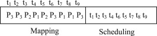
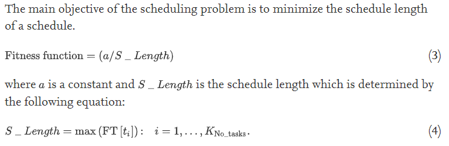
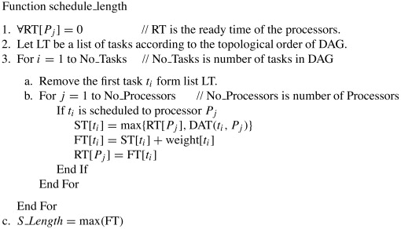
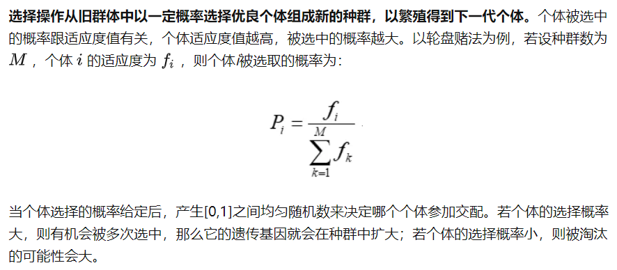
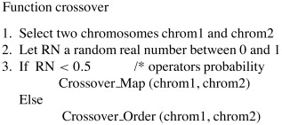
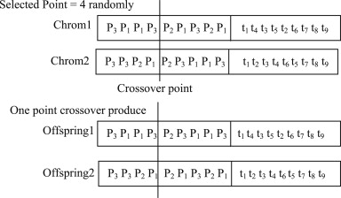
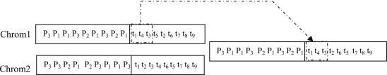
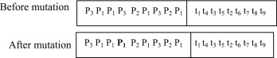
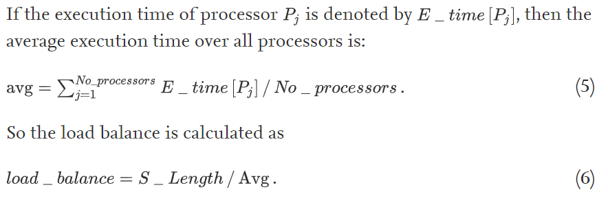
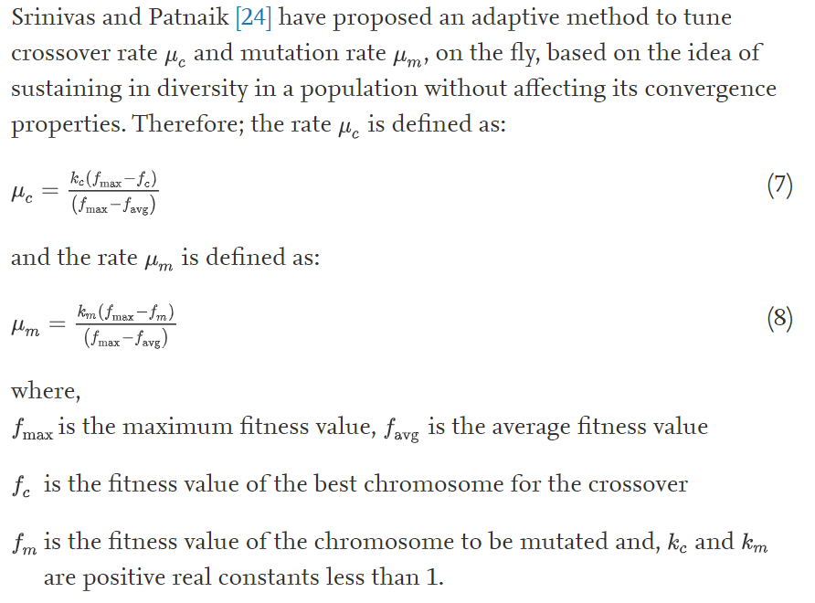

# Genetic algorithms for task scheduling problem

链接：[Genetic algorithms for task scheduling problem](https://www.sciencedirect.com/science/article/pii/S0743731509001804)

参考：[遗传算法入门详解](https://zhuanlan.zhihu.com/p/100337680)

## 染色体

任务调度问题可以被编码为下图的染色体，其中前半部分为任务 $t_i$ 被调度到的处理器 $P_i$，这是按照任务的下标 $i$ 顺序排列的；后半部分为任务的执行顺序，比如 $t_3,t_1,t_0$ 代表任务实际执行顺序为 $t_3\rightarrow t_1 \rightarrow t_0$。

## SGA(Standard Genetic Algorithm)

标准的遗传算法使用以下的步骤：

1. 随机生成初始集群

   染色体的第一部分是从可用的处理器中随机选择的；第二部分也是随机生成的，但是要保证图的拓扑顺序。

2. 选择合适的 fitness 函数：

   由于本论文针对的是工作流任务调度，因此目标是使得所有任务完成时间中的最大值最小，所以制定了如下 fitness 函数，可以针对实际情况设计不同的 fitness 函数。

   

   伪代码如下所示：

   

3. 选择阶段（select）

   分为两种，一种是轮盘赌（roulette），一种是（二元）锦标赛（tournament）。由此选择出后续参与交叉（crossover）和变异（mutation）的父辈。

   如果使用了精英策略（elitism），fitness 最大的个体一定会被选择到。

   

   
轮盘赌算法，摘自https://zhuanlan.zhihu.com/p/100337680

4. 交叉阶段（crossover）

   任意两个染色体有一定概率 $\mu_c$ 进行交叉操作，交叉操作分为两种，一种是 `Crossover_Map` 一种是 `Crossover_Order`。

   

   + Crossover Map

     只修改第一部分，随机选取一个交叉点，将交叉点后的内容互换。

     

   + Crossover Order

     

5. 变异阶段（mutation）

   任意染色体都有一定概率 $\mu_m$ 进行变异操作。

   随机选取第一部分的一位进行修改（即修改某一个任务调度到的处理器）。

   

## 改进

+ 不用完全随机的方式生成初始集群，使用一些策略来生成一些近似解作为初始集群；

+ 优化 fitness 函数，使其能够获得更好的负载均衡，或者使用多个 fitness 函数。

  

+ 使用动态自适应概率。

  
