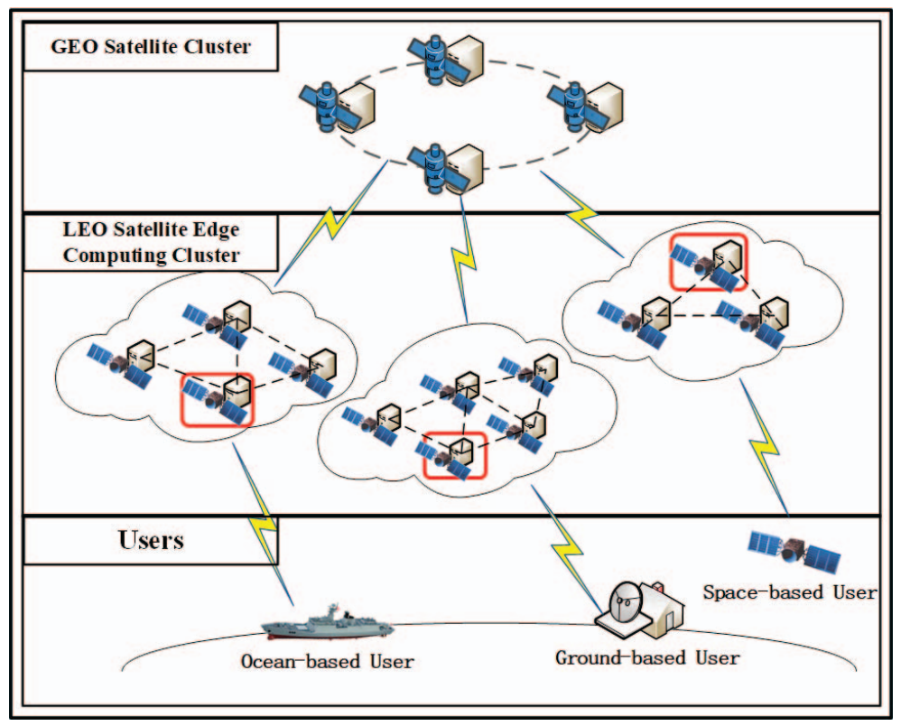
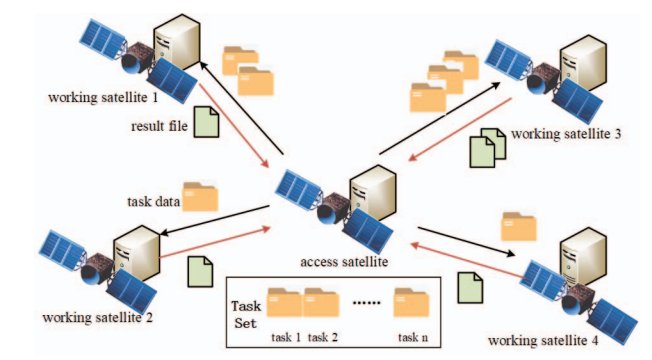
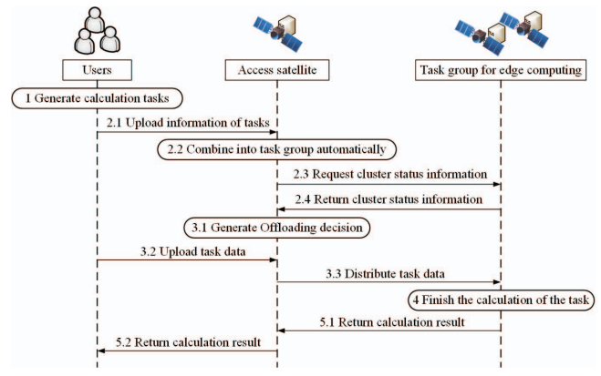
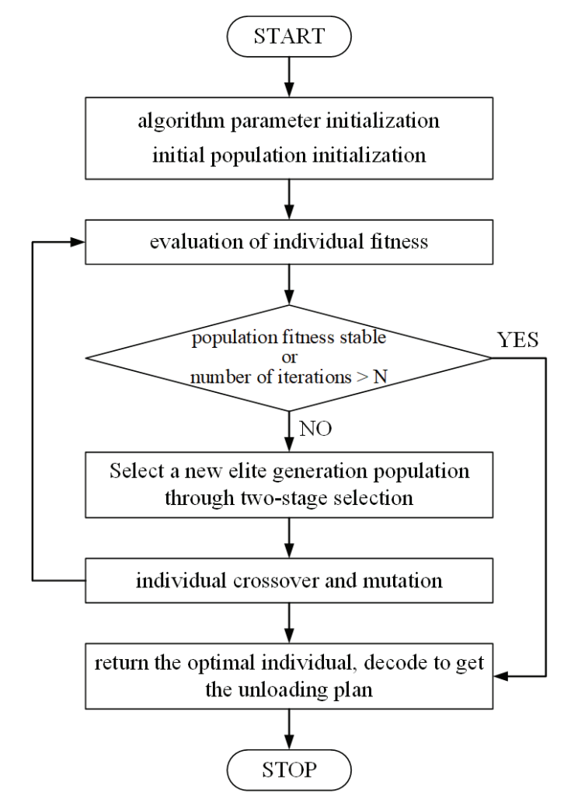
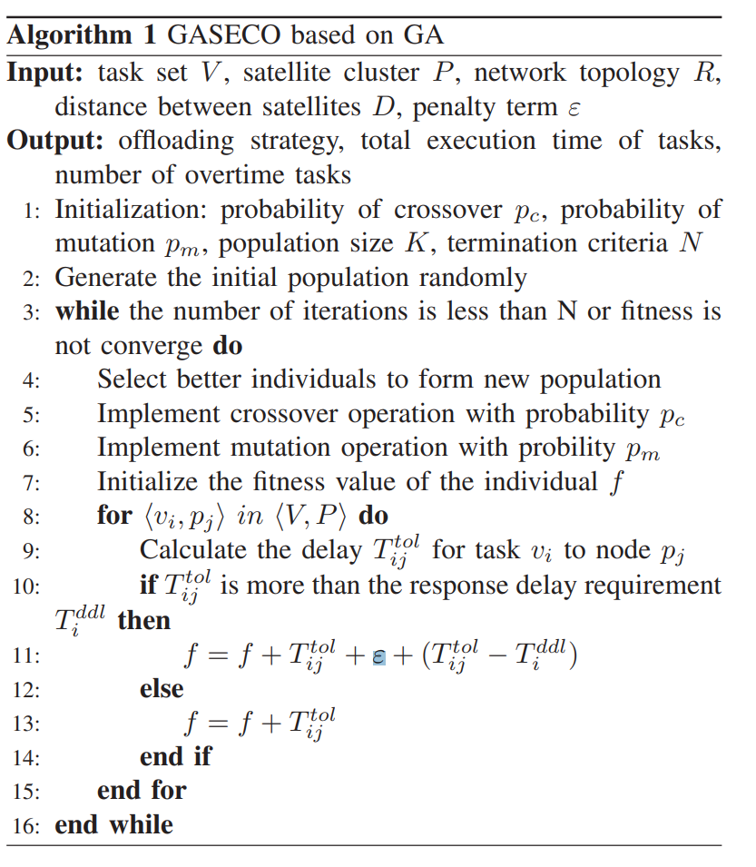
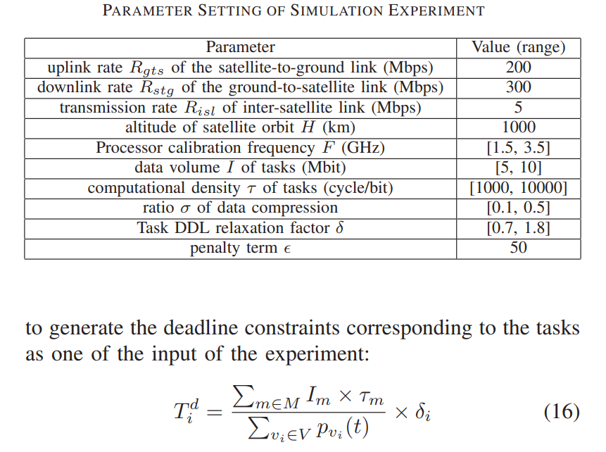

# Computation Offloading Strategy of Multi-satellite Cooperative Tasks Based on Genetic Algorithm in Satellite Edge Computing

链接：[Computation Offloading Strategy of Multi-satellite Cooperative Tasks Based on Genetic Algorithm in Satellite Edge Computing](https://ieeexplore.ieee.org/abstract/document/8689224)

## 架构

由一颗 `Access Satalliete` 作为门户，将任务卸载到其他的卫星。

## 卸载流程

## 建模

|参数|含义|
|---|---|
|$V$|低轨道卫星群中所有卫星节点的有限集合|
|$v_i$|第 $i$ 号卫星节点|
|$E$|可以在卫星网络中建立的所有卫星间链路的集合，由星座配置决定|
|$t$|当前时刻|
|$R_{I S L}$|受硬件资源约束和能耗约束的卫星间链路的传输速率|
|$R_E(t)=\left\lbrace r_{e_{i j}}(t) \mid e_{i j} \in E, r_{i j}(t) \in\left\lbrace 0, R_{I S L}\right\rbrace\right\rbrace$|$t$ 时刻所有卫星间链路的传输速率的集合（时变，非负）|
|$L_E(t)=\left\lbrace l_{e_{i j}}(t) \mid e_{i j} \in E, l_{e_{i j}}(t)>0\right\rbrace$|$t$ 时刻卫星节点 $v_i$ 和 $v_j$ 之间的距离|
|$P_V(t)=\left\lbrace p_{v_i}(t) \mid v_i \in V, p_{v_i}(t) \in\left[0, p_{v_i}^{M A X}\right]\right\rbrace$|$t$ 时刻卫星节点 $v_i$ 的可用计算能力|
|$P_V^{M A X}=\left\lbrace p_{v_i}^{M A X} \mid v_i \in V\right\rbrace$|集群中每个节点的峰值处理能力|
|$p_{v_i}^{M A X}=M I P S_{v_i} \times cpuclocks$|卫星节点 $v_i$ 可以提供的计算能力的校准值|
|$R_{gts}$|从地面站到卫星节点的上行链路传输率|
|$R_{stg}$|从卫星节点到地面站的下行链路传输率|
|$M=\left\lbrace m_{i} \mid m_i=\right.\left.\left\lbrace I_i, T_i^d, \tau_i, \sigma_i\right\rbrace\right\rbrace$|需要卸载到用户端的卫星边缘计算集群的一组任务，任务集中的任务之间没有约束关系|
|$I_i$|任务 $m_i$ 的输入数据量|
|$T_i^d$|任务 $m_i$ 的截止日期|
|$\tau_i$|任务 $m_i$ 的计算密度|
|$\sigma_i$|任务 $m_i$ 的数据压缩比，即输出数据量与输入数据量的比率|

### 通信/计算延迟模型

|等式|含义|
|---|---|
| $T_m^{t x_{-} u p}=\frac{I_m}{R_{g t s}}$  | 数据卸载阶段的传输延迟 |
| $T_{m n}^{t x_{-} d i s}(t)=\frac{h o p_{0 n}(t) \times I_m}{r_{e_{0 n}}(t)}$ | 数据分发阶段的传输延迟  |
| $T_{m n}^{t x_n r e}(t)=\frac{h o p_{0 n}(t) \times I_m \times \sigma_m}{r_{e_{0 n}}(t)}$ |结果总结阶段的传输延迟|
| $T_m^{t x_{-} d o w n}=\frac{I_m \times \sigma_m}{R_{s t g}}$ | 结果返回阶段的传输延迟 |
| $T_{m n}^{t x}=T_m^{t x_{-} u p}+T_{m n}^{t x_n d i s}(t)+T_{m n}^{t x_n r e}(t)+T_m^{t x_{-} d o w n}$ | 总传输延迟 |
|$T_{m n}^{{prop_{-}dis }}(t)=\sum_{e_{x y} \in \text { route }_{0 n}(t)} \frac{l_{e_{x y}}(t)}{C}$|数据卸载阶段的传播延迟|
|$T_{m n}^{{prop_{-}re }}(t)=\sum_{e_{x y} \in \text { route }_{n 0}(t)} \frac{l_{e_{x y}}(t)}{C}$|结果总结阶段的传播延迟|
|$T_m^{{prop_{-}up }}=T_m^{{prop_{-}down }}=\frac{H}{C}$|结果上传和返回阶段的传播延迟|
|$T_{m n}^{{prop }}(t)=T_m^{{prop_{-}up }}+T_{m n}^{{prop_{-}dis }}(t)+T_{m n}^{{prop_{-}re }}(t)+T_m^{{prop_{-}down }}$|总传播延迟|
|$T_{m n}^{c o m}(t)=T_{m n}^{t x}(t)+T_{m n}^{p r o p}(t)$|总通信延迟|
|$T_{m n}^{p r o c}(t)=\frac{I_m \times \tau_m}{p_{v_n}(t)}$|计算延迟|
|$T_{m n}^{tol}(t)=T_{m n}^{c o m}(t)+T_{m n}^{p r o c}(t)$|总延迟|

由此得到线性规划问题：
$$
\begin{gathered}
\arg \min \sum_{n=1}^N \sum_{m=1}^M T_{m n}^{t o l}(t) x_{m n} \\
\text { s.t. }\left\{\begin{array}{l}
\sum_{n=1}^N T_{i n}^{t o l}(t) x_{i n} \leq T_i^d \quad i=1,2, \ldots, M \\
\sum_{n=1}^N x_{i n}=1 \quad i=1,2, \ldots, M \\
x_{m n} \in(0,1)
\end{array}\right.
\end{gathered}
$$

## GASECO 算法

基于遗传算法（`Genetic Algorithm`）进行改进，提出了 `GASECO` 算法：

+ 基本流程与传统遗传算法一致：

  > 该算法分为五个步骤：第一步发现和种群初始化，并用数字编码表示问题的可能解决方案。第二步是评估个人健康状况。第三步是使用排序和轮盘选择进行过滤，消除最后20%的个人，然后使用轮盘选择。第四步是编译和交叉操作解，以增加解空间并加速收敛。最后，由阈值判定算法是否结束。
  
    
  
+ 对 `individual fitness evaluation` 阶段进行了改进：
  1. 对于超时任务数量的优化，如果受任务特性和物理环境的限制，卸载到卫星边缘集群的任务无法按时完成，因此超时任务的数量尽可能少；
  2. 对于超过最后期限的任务，超时时间越短越好，以确保任务集的总体完成时间最短。
  
  
  
## 实验设置

> 在本实验中，选择了用于模拟验证的d-walker星座配置器，其轨道平面和每个轨道平面中的卫星均匀分布。在名为STK的卫星仿真工具中建立星座模型，并获得卫星网络拓扑和卫星间链路的数据，这是GASECO算法的输入。地面用户产生许多需要应急响应的独立任务。这些任务被卸载到卫星边缘计算集群进行处理，以实现快速响应。实验中的相关参数设置如表I所示。GAECO算法优化了任务集的卸载成功率。因此，需要在模拟实验中模拟每个任务的最后期限约束，以描述不同任务的QoS要求。

