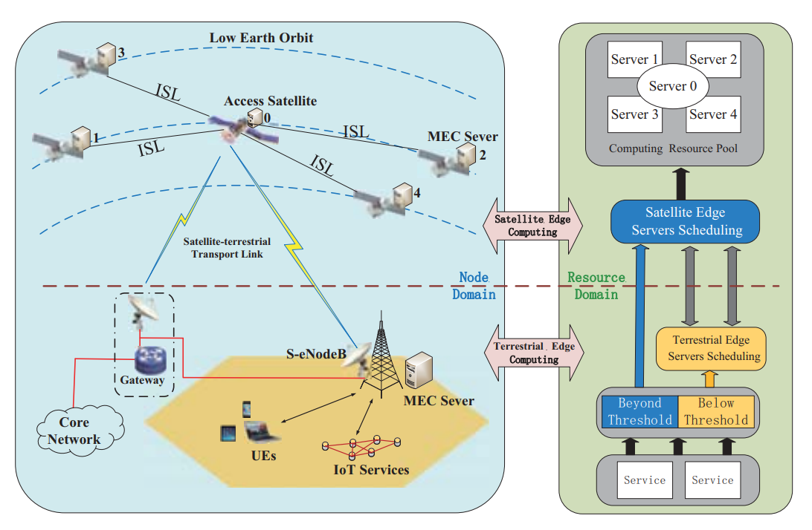
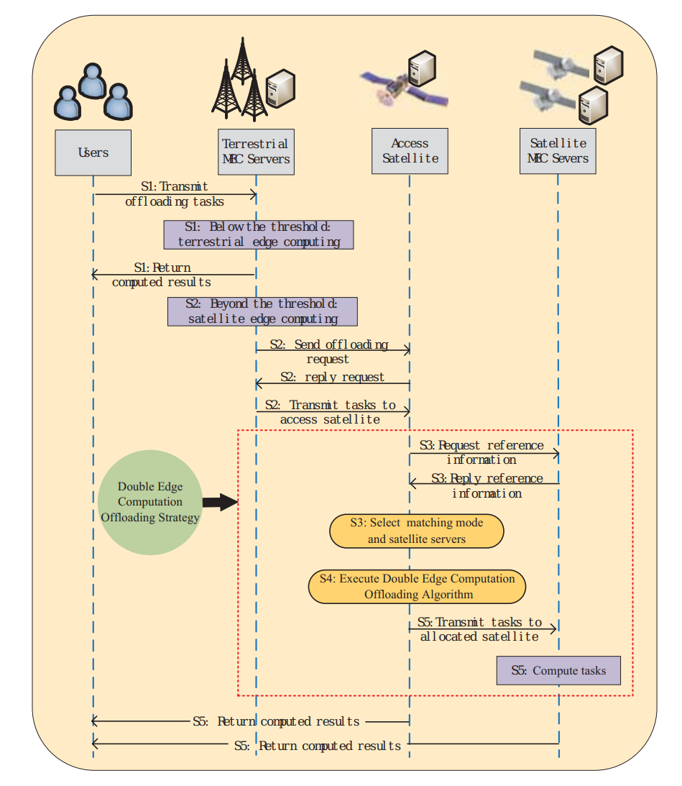

# A Computation Offloading Strategy in Satellite Terrestrial Networks with Double Edge Computing

链接：[A Computation Offloading Strategy in Satellite Terrestrial Networks with Double Edge Computing](https://ieeexplore.ieee.org/abstract/document/8689224)

提出了一种双边缘计算卫星地面网络体系结构：

优先卸载到地面边缘服务器，如果负载超过承受能力，则卸载到卫星边缘集群（于此同时卫星边缘集群可以覆盖到更偏远的地区，为其提供服务）。

