# An advanced decision model enabling two-way initiative offloading in edge computing

## 笔记

链接：[An advanced decision model enabling two-way initiative offloading in edge computing](https://www.sciencedirect.com/science/article/pii/S0167739X17329527?via%3Dihub)

### 层级
   
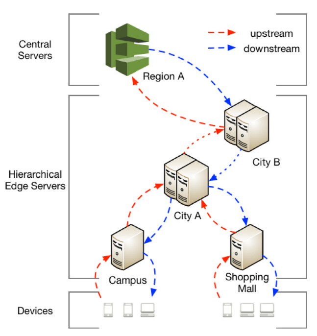

随着物联网的发展，很多设备从数据产生者变为了数据消费者，对于很多时延敏感的请求，可以考虑在本地执行（如果具有充足计算能力），也可以
将任务卸载到尽可能近的节点（通过若干跳）。

当一个请求被发送时，它实际上会经过多个服务器，并形成从原始服务器到中央服务器的路径。
一个请求将生成一条路径；大量请求将生成大量不同的路径。由于层次结构，这些路径可能相交、重叠或收敛。
然后，位于连接点的边缘服务器可能会过载，形成任务队列，甚至因为请求的涌入而拥塞。
例如，如图1所示，如果下面的所有设备都决定将其请求卸载到购物中心的边缘服务器，则该服务器将变得拥塞。
因为更高层的服务器更可能是更多路径的连接点，所以拥塞也可能发生在更高层，而不管这些服务器通常更强大。
一些传统的解决方案假设边缘服务器是黑匣子，这样它们可以按预期处理所有请求（看起来像我们的原始决策模型）。
不幸的是，拥堵在现实中可能会出乎意料地发生。
其他解决方案应用一些全局放置策略来调度这些请求。但是，结果是，调度变成了一项离线工作，预期的建模变得不可避免。
    
### 系统模型

+ 请求和服务器模型

    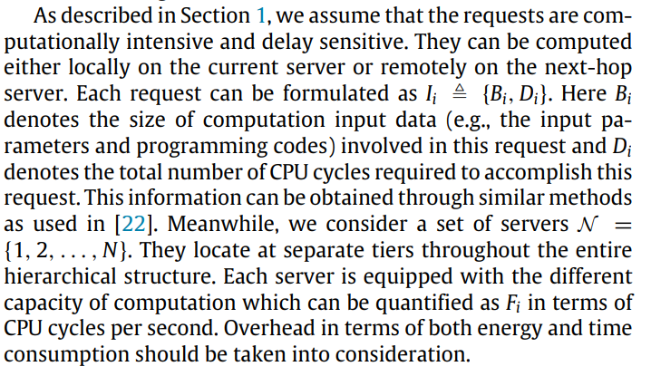

+ 计算损耗模型
    
    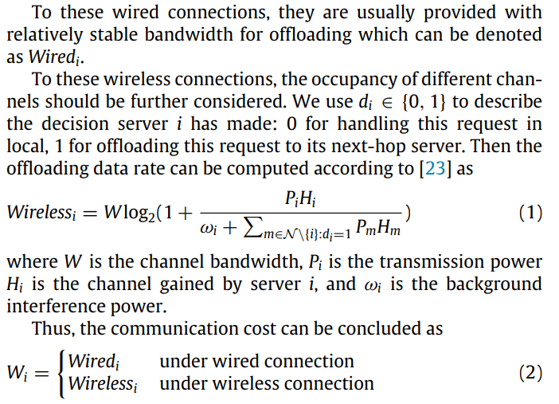

+ 本地开销模型

    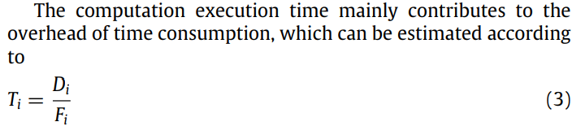
    
    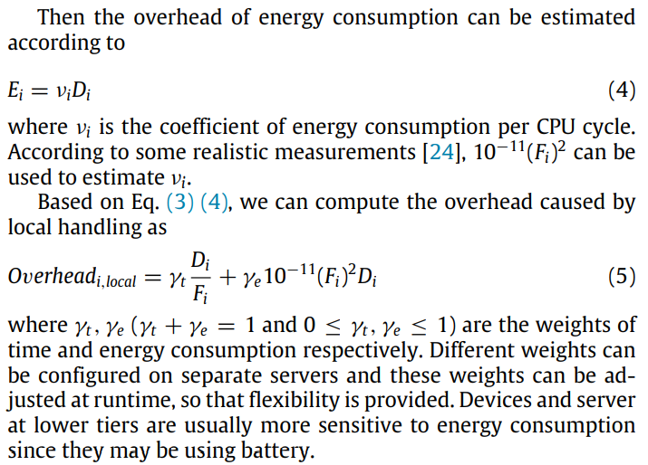

+ 卸载开销模型

    包含任务卸载消耗 + 任务执行消耗。
    
    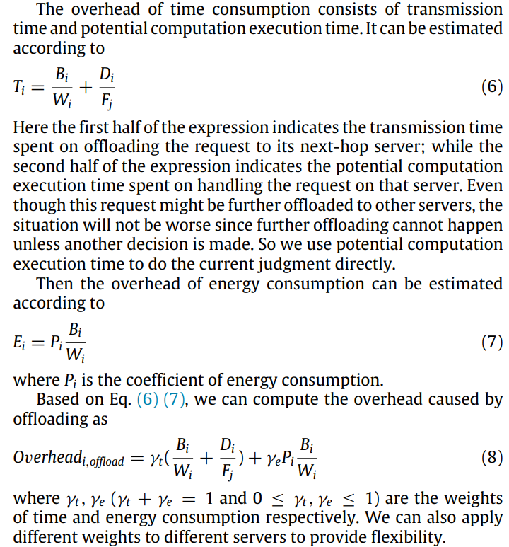
 
+ 忽略了传回结果的时间消耗，因为对比于输入的数据规模，结果的数据规模通常可以忽略不记。
    
     > Similar to many studies such as [9,6,15], we also neglect the
      time overhead for sending back the outcomes, because of the fact
      that the size of outcomes is generally very small compared with
      the input data.

+ 决策过程

    根据原始决策模型的假设，一个服务器只为一个到达的请求提供服务，我们可以根据两个选择的开销之间的比较直接做出决策。
       
### 更进一步的决策模型

+ 原始决策模型不会产生任何拥塞，但是实际上我们必须考虑拥塞的情况。通过如下修改，将卸载任务的目标节点的任务等待队列纳入考量，避免将任务卸载到已经过载的节点。

    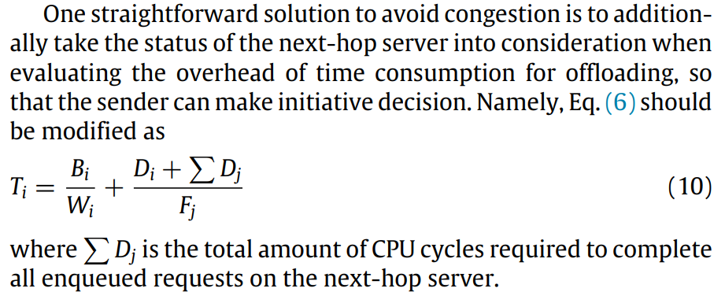

    但是如上的改进仍然不够，这是因为设备获取的状态信息可能是过时的，并且拥塞可能在做出决定后立即发生。

+ RED
    
    随机早期检测（RED），也称为随机早期丢弃或随机早期丢弃，是适用于拥塞避免的网络调度器的著名排队规则。
    只有排队的数据报将被处理。`RED` 通过加权移动平均模型监测队列大小，并根据统计概率丢弃数据图。
    当缓冲区为空时，它将接受所有传入的数据报。随着队列的增长，它将根据增长的概率丢弃传入的数据报。
    当队列最终满时，丢弃的概率将达到1，所有传入的数据报都将被丢弃。
    
    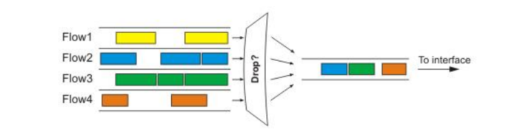
    
    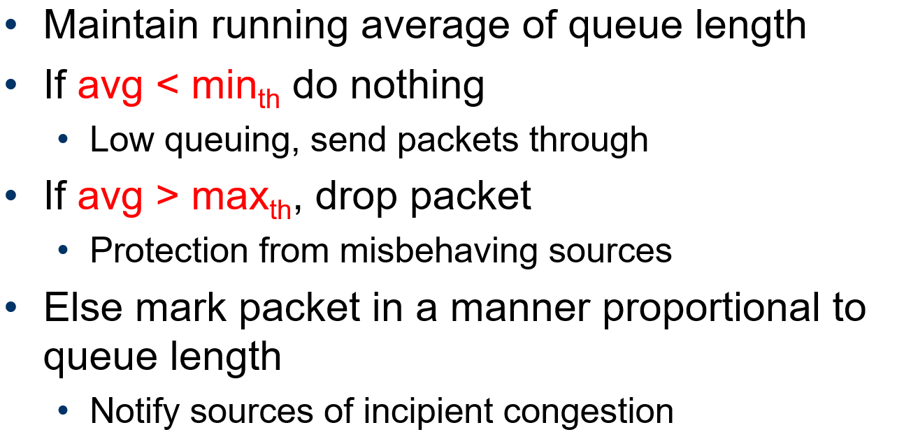
    
    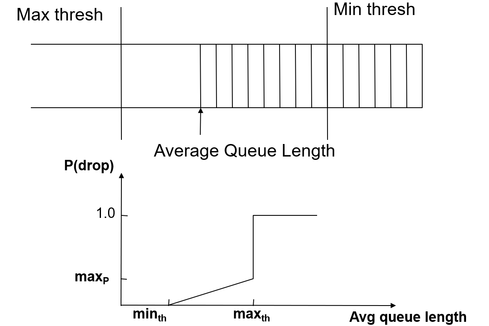
        
    > 在卸载上下文中，“丢弃请求”表示将其卸载到下一跳服务器，而“处理请求”表示对其做出决定。
    当当前服务器已经过载时删除请求可以帮助请求直接跳转队列。这也使得作为接收者的服务器能够根据其能力选择性地接受请求。
    确实，这种主动丢弃可能会自私地将负担推给下一跳服务器。然而，高层服务器通常更强大。
    当当前服务器和下一跳服务器都有负担时，后者应该承担更多的责任。它并不违背边缘计算的初衷。
    
    这一点很有意思，**将 RED 的 drop 的语义定义为任务卸载到上一级**。
    
    论文对 RED 进行了一系列修改：
    
    + 将“队列大小”的计算更改为计算完成处理所有排队请求的预期时间。
        
      > the evaluation of "the queue size" is altered into calculating the expected time to finish processing all enqueued requests.
 
    + 修改 RED 算法中的 $$min_{th}$$ 和 $$max_{th}$$
        
        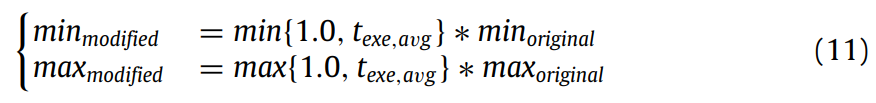
        
        > Here $t_{\text {exe,avg }}$ is the average execution time of these enqueued requests. For the lower bound, when enqueued requests require
                                      relatively large amount of computation, the threshold represents
                                      the absolute execution time; when enqueued requests require
                                      relatively small amount of computation, the threshold represents
                                      the expected execution time for $min_{\text {original }}$ requests. For the upper
                                      bound, we choose to extend the range for calculating the growing
                                      probability as wide as possible, so that the current server will not
                                      totally "deny" requests too early and the resource can be fully
                                      utilized.
    
    + 修改一些其他的重要参数
        
        > some other key parameters should also be modified,
          such as $$w_q$$ and $$max_p$$. provided some suggestions on setting
          these parameters
    
    
**增强的决策模型关注下一跳的服务器的状态，而 `RED` 算法则是关注当前服务器的状态，两者相辅相成。** 论文也基于两者设计出了如下的系统：
    
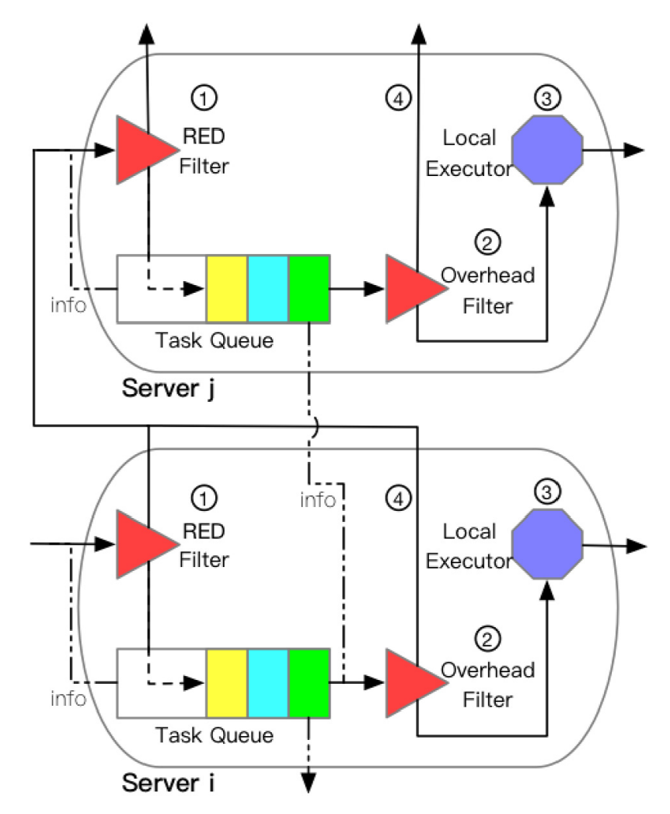

+ 基于 `RED` 算法和上述修改实现了一个 `RED Filter`。它作为每个服务器的核心。`RED Filter` 将从当前服务器维护的任务队列中收集队列信息（info），并使用加权移动平均模型来评估卸载的可能性。
要“丢弃”的请求将在排队之前卸载。

+ 每个排队的请求在成为任务队列的头部时都将被处理。另一个名为 `Overhead Filter` 的过滤器将在那里决定请求是在本地处理还是卸载到下一跳服务器。`Overhead Filter` 
将从下一跳服务器维护的任务队列中收集队列信息，并采用 `advanced decision model`。

+ 如果请求计划在本地处理，它将转发给 `Local Executor`。执行器将执行计算，然后将结果发回。

+ 如果请求被卸载，它将被传输到下一跳服务器（next-hop server）的入口。该请求将由那里的 `RED Filter`与其他请求一起进一步判断，包括也卸载到该服务器的请求以及该服务器自身生成的请求。

### 评估和仿真

简单的层级拓扑（下面的数字代表 index : available computation）：

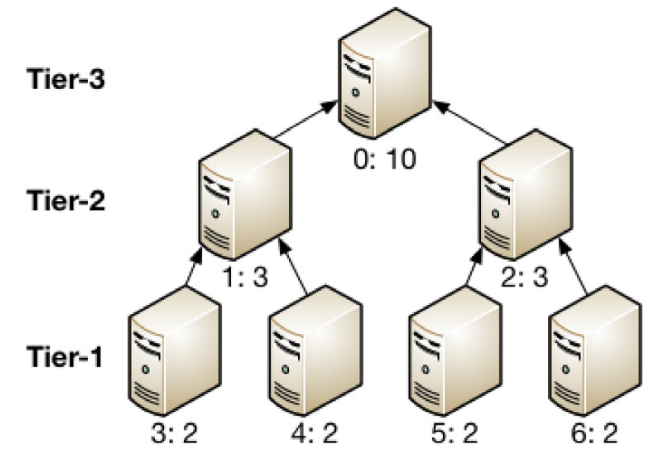

+ 一个任务生成器负责定期将请求推送到第1层的服务器。每个周期的请求数（表示工作负载率）是根据泊松分布确定的。

+ 每个请求所需的计算（表示请求大小）将按照正态分布进一步确定。

+ 在不失一般性的情况下，选择请求的平均完成时间作为性能指标，（平均完成时间越短，表明整个系统提供的计算能力越大。）

+ 记录了每台服务器为辅助分析处理的请求数。

