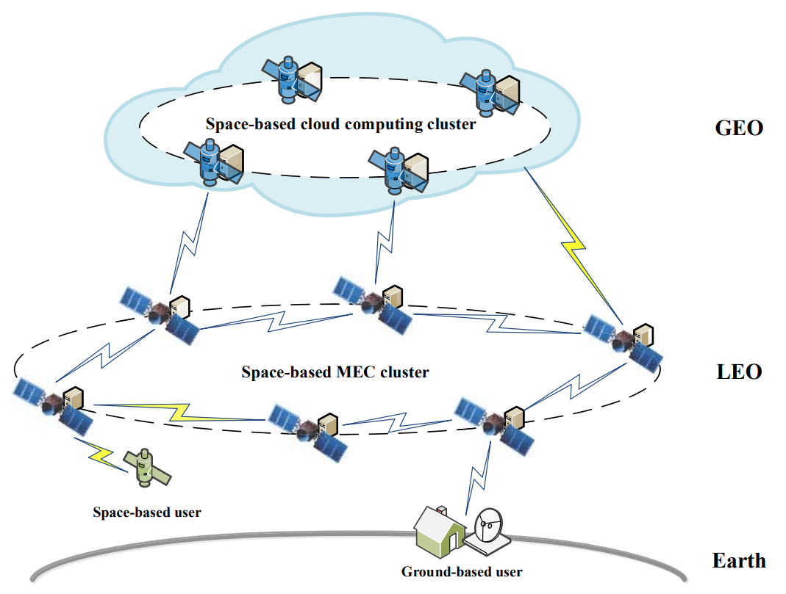
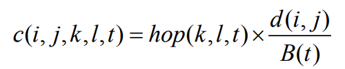
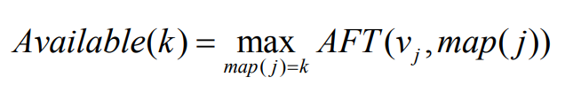
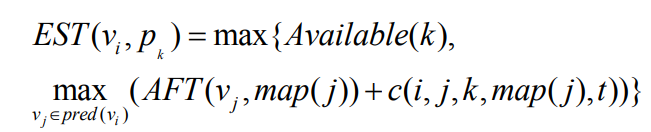
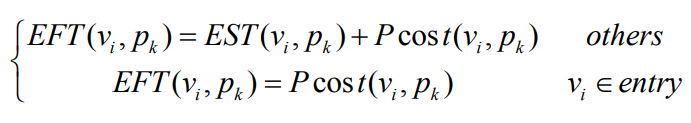
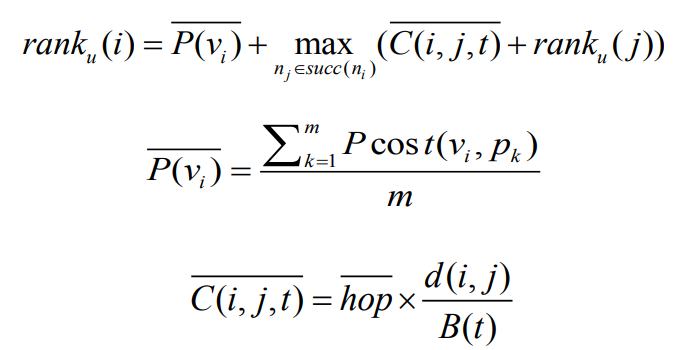
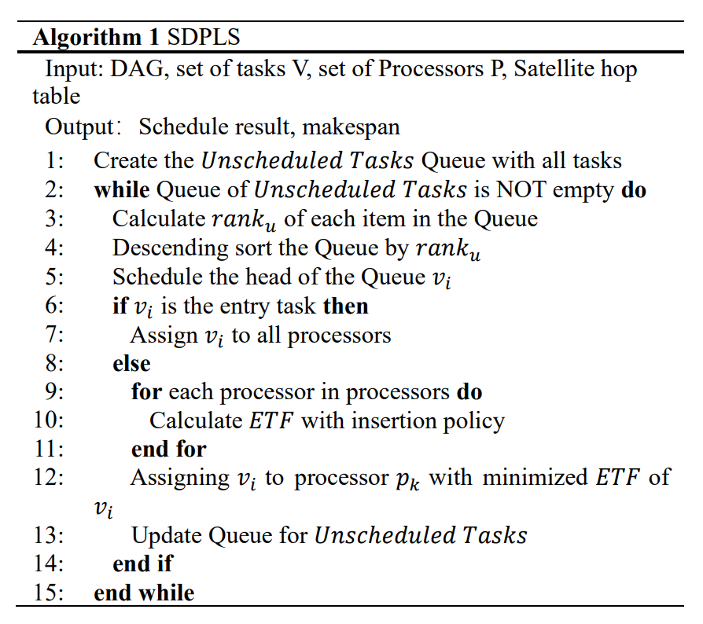

# Task Scheduling of High Dynamic Edge Cluster in Satellite Edge Computing

链接：[Task Scheduling of High Dynamic Edge Cluster in Satellite Edge Computing](https://ieeexplore.ieee.org/document/9284173)

## 卫星架构

+ 由两个重要部分组成：
    
    + MEC(Mobile Edge Computing) layer: 接近数据源，低延迟
    
    + Cloud computing layer: 担任协调员的工作，负责长期数据分析、环境维护、服务提供等，可以更好地支持卫星大数据服务的执行。
    
    云计算将大数据分析规则传递到边缘端，以实现数据端任务的实时处理，帮助快速响应卫星延迟敏感服务。
    
+ 执行流程：
    
    1. 空间用户或地面控制中心生成任务，并将计算任务摘要（`task profile`）（包括数据量计算、延迟要求等）上传到其通信范围内的边缘节点，假设为节点A。
    2. 节点 A 粗略评估任务要求，执行任务卸载决策，并决定当前任务是由边缘集群处理还是由卫星云计算层处理。节点 A 将决策反馈给用户。（在这一步中，我们假设边缘节点仅对任务及其计算能力进行粗略估计。这一过程很快，因此在此期间，节点 A 和用户始终可以相互通信。）
    3. 用户根据卸载策略执行卸载操作，并将任务卸载到卫星边缘计算层或卫星云计算层。
    4. 边缘计算层或云计算层将向用户反馈计算结果。

+ 优点
    
    + 计算中心（卫星边缘集群或卫星云计算集群）更靠近数据源（观测卫星），避免了长距离数据传输带来的高带宽利用率和长响应延迟的问题。
    
    + 在一些通信受限的特殊场景和地区，卫星网络的通信能力和计算能力可以有效满足任务处理的要求。
    
    + 分散在每个卫星上的计算资源集成在该架构中，向外部提供统一的计算能力，实现了卫星资源的高效利用，并提供了低延迟和高可靠性的计算支持。
    
    
## 建模和优化

该论文针对异构的静态任务调度进行改进，考虑了卫星动态网络（拓扑图动态变化），在已有的算法 [`HEFT`](https://en.wikipedia.org/wiki/Heterogeneous_earliest_finish_time) 和 [`PEFT`](https://ieeexplore.ieee.org/document/6471969) 等的基础上进行优化。

### 建模

|参数   |含义   | 
|---|---|
| $$n$$  | 卫星数量  | 
| $$p$$ | 处理器（卫星）数量 |
| $$p_i$$ | 第 i 号卫星|
| $$v_i$$  | 第 i 号子任务   | 
| $$d\left(v_i\right)$$| 第 i 号子任务要处理的数据总量 |
|$$d(i, j)$$| 在子任务之间传输的数据总量 |
|$$\text { pred }\left(v_i\right)$$|前置任务|
| $$\operatorname{succ}\left(v_i\right)$$| 后置任务 |
|$$P \operatorname{cost}\left(v_i, p_j\right)$$| 第 i 号任务在第 j 号卫星上执行的时间|

<table>
    <tr>
        <td>模型</td>
        <td>含义</td>
    </tr> 
    <tr>
        <td></td>
        <td>hop 和 B(t) 两项分别表示在 t 时刻 k 号卫星和 l 号卫星之间的路由跳数，以及分配给任务传输的网络带宽</td>
    </tr> 
    <tr>
        <td></td>
        <td>第 k 号卫星的最早可用时间，`AFT` 代表子任务的实际完成时间</td>
    </tr>
    <tr>
        <td></td>
        <td>第 i 号子任务在第 k 号卫星上的最早开始执行时间</td>
    </tr>
    <tr>
        <td></td>
        <td>第 i 号子任务在第 k 号卫星上的最早完成时间</td>
    </tr>
    <tr>
        <td></td>
        <td>类似 HEFT 中的任务优先级计算公式</td>
    </tr>
</table>

### 算法

论文提出的 `SDPLS` 算法：

